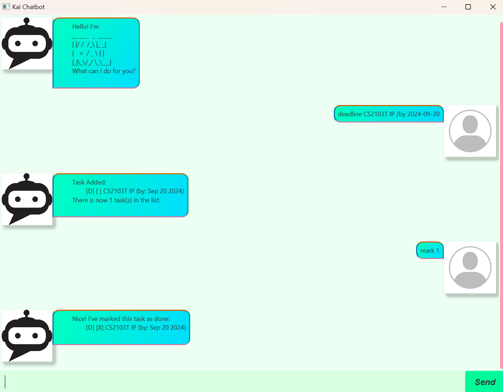

# Kai User Guide



Kai is a chatbot designed to help you get ideas out of your mind,
so that you can generate new ones without worrying about forgetting the old ones.

Below are the supported commands and their explanations:

## Listing the current Tasks

This Command lists out the current Tasks if any.\
(Tasks are saved across chatbot sessions)

Format: `list`

Sample Output:
```
Here are the tasks in your list.
1. [T] [ ] Buy groceries
```

## Marking a task as done

This Command marks the task in the specified index as done.\
The valid range of numbers start from 1 up to the number of tasks that are in the chatbot.\
(This Command will not work if there are no Tasks present)

Format: `mark [task number]`\
Example: `mark 1`

Sample Output:
```
Nice! I've marked this task as done:
    [T] [X] Buy groceries
```

## Marking a task as not done

This Command marks the task in the specified index as not done.\
The valid range of numbers start from 1 up to the number of tasks that are in the chatbot.\
(This Command will not work if there are no Tasks present)

Format: `unmark [task number]`\
Example: `unmark 1`

Sample Output:
```
Ok, I've marked this task as not done yet:
    [T] [ ] Buy groceries
```
## Finding specific Task(s)

This Command lists out the Tasks whose description contains the specified string.\
However, do note that this string is case-sensitive.

Format: `find [string]`\
Example: `find Buy`

Sample Output:
```
Here are the matching tasks in your list:
1. [T] [ ] Buy groceries
```

## Adding a new Task

This version of the chatbot has three types of Tasks:
To Do, Deadline and Event.

### To Do

This Command adds a new To Do Task to the list with the specified description.

Format: `todo [description]`\
Example: `todo Finish Your Homework`

Sample Output:
```
Task Added:
    [T] [ ] Finish Your Homework
There is now 2 task(s) in the list.
```

### Event

This Command adds a new Event Task to the list with the specified description and dates.\
Note that the dates needs to be in YYYY-MM-DD format to be accepted.

Format: `event [description] /from [date] /to [date]`\
Example: `event Exams /from 2024-10-09 /to 2024-10-15`

Sample Output:
```
Task Added:
    [E] [ ] Exam (from: Oct 09 2024 to: Nov 15 2024)
There is now 3 task(s) in the list.
```

### Deadline

This Command adds a new Deadline Task to the list with the specified description and date.\
Note that the date needs to be in YYYY-MM-DD format to be accepted.

Format: `deadline [description] /by [date]`\
Example: `deadline Thesis /by 2025-01-11`

Sample Output:
```
Task Added:
    [D] [ ] Thesis (by: Nov 01 2025)
There is now 4 task(s) in the list.
```

## Delete Task

This Command deletes the Task in the specified index.\
The valid range of numbers start from 1 up to the number of tasks that are in the chatbot.\
(This Command will not work if there are no Tasks present)

Format: `delete [number]`\
Example: `delete 2`

Sample Output:
```
Noted. This task has been removed:
    [T] [ ] Finish Your Homework
There is now 3 task(s) in the list.
```

## Exiting the chatbot

This Command causes the chatbot to exit and close.

Format: `exit`

Sample Output (before closing):
```
Bye. Hope to see you again soon!
```